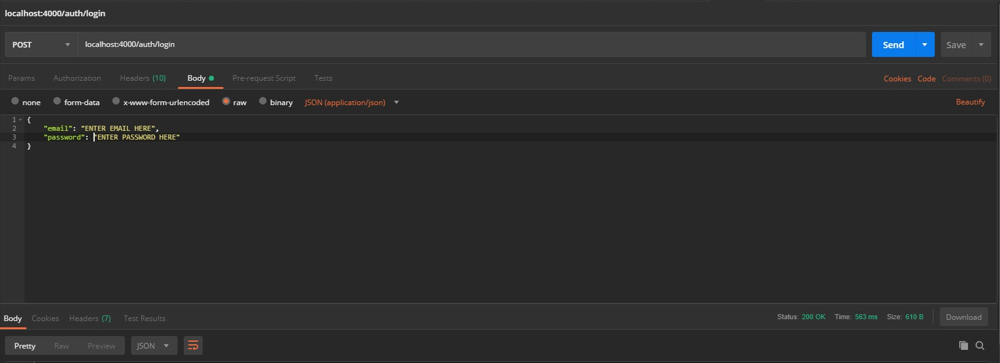
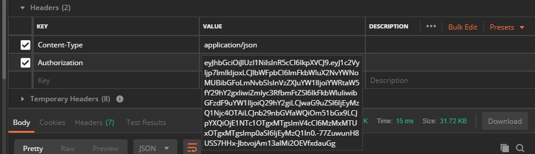

# Guidelines to complete testing in Postman

If you don't have Postman you can download it [here](https://www.getpostman.com/).  We used Postman in our manual testing.

One of the most important things to do when testing the endpoints through the Postman application is to first do a login request.

Once the login request was made correctly, you will get a token back as a response. That token is very important when it comes to 
trying to test all the protected endpoints. 

You will need to copy the token that is recieved with out the double quotes and that will need to be placed in the Headers with the value of Authorization and the value you would paste the token. 

Now you will be good to test all the endpoints that are being used in the application.

- The only endpoints that are able to be tested without the authorization token are: 
    1.  the search endpoints
    2.  the schedule endpoints for the public view calendar